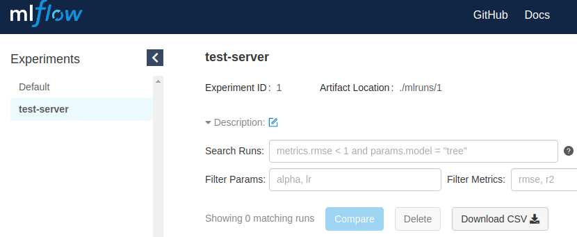
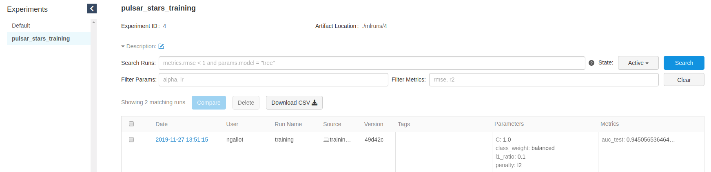

# mlflow-demo
A demo project using MLflow machine learning lifecycle management platform.
We use here a public Kaggle dataset, and we're building an ML model for predicting a pulsar star.


### Data
You can find the data and its description [here](https://www.kaggle.com/pavanraj159/predicting-a-pulsar-star/version/1#).
You can create a directory named data at the root of your project and download the contents of the CSV in it, the unzip it.

### Project setup
To run this project, it is recommended to first setup a virtual environment and install the requirements.txt in it.
```bash
virtualenv -p path/to/your/python venv
source venv/bin/activate
pip install -r psp/requirements.txt
```

### Writing the minimal training script
Now that we've built our local mlflow server, we can write a minimal training script for our ml model.

The code is in
```bash
psp/training.py #psp stands for pulsar stars predictor
```

Here we build a very simple model with Scikit Learn. The goal is not to spend time on model optimization,
but rather deploy a working model quickly. We will still have the opportunity to enhance it once a first version is developed.
However, a very important concept here is to always use pipelines to train ml models. The concept of pipelines is present in almost every ml library. It allows easier deployment.

Our pipeline includes:
- A StandardScaler
- A cross validated logistic regression

We also define our metrics to follow, here it's the AUC.

To run the training script, just run the command: 
```bash
python psp/training.py --data-path ./data/pulsar_stars.csv --test-size 0.2
```


### Setup local mlflow tracking server
In this section, we will build a Docker container exposing the mlflow-tracking server api. It will allow us to update our training script in order to log metrics and
models in mlflow.

The contents of this server is very simple: just a Dockerfile with very few instructions.

```dockerfile
FROM python:3.7-slim-stretch

# Install mlflow
RUN python -m pip install --upgrade pip mlflow==1.4.0

# Expose mlflow port
EXPOSE 1234

# Define entry point
ENTRYPOINT mlflow server --host 0.0.0.0 --port 1234
```
Then we define a docker-compose file at the project root to build this service:

```yaml
version: '3.1'

services:
  mlflow-server:
    build:
      context: mlflow-server
      dockerfile: Dockerfile
    image:
      mlflow:1.4.0
    ports:
      - "1234:1234"
```

To start the mlflow server, we just have to run the command: 
```bash
docker-compose up --build mlflow-server
```
It will expose the mlflow api at http://localhost:1234

You can the easily test the server using mlflow command line (from your venv):
```bash
export MLFLOW_TRACKING_URI=http://localhost:1234
mlflow experiments create -n test-server
```

Then you can see your created experiment:
```bash
mlflow experiments list

# Experiment Id  Name         Artifact Location
#---------------  -----------  -----------------------------------------------
#              0  Default      /home/**/mlflow-demo/mlruns/0
#              1  test-server  /home/**/mlflow-demo/mlruns/1
```

You can also visualize it in the mlflow UI by opening a browser to http://localhost:1234:

<p align="center">
  
</p>

This experiment was just for testing so we can now delete it: 
```bash
mlflow experiments delete -x 1
```

### Using mlflow in our training script
Now that we have a working mlflow server, we can use it to export both our model and our training metrics.

We first create a utility function to create or retrieve an experiment by its name: 
```python
def get_or_create_experiment(experiment_name) -> Experiment:
    """
    Creates an mlflow experiment
    :param experiment_name: str. The name of the experiment to be set in MLFlow
    :return: the experiment created if it doesn't exist, experiment if it is already created.
    """
    try:
        client = MlflowClient()
        experiment: Experiment = client.get_experiment_by_name(name=experiment_name)
        if experiment and experiment.lifecycle_stage != 'deleted':
            return experiment
        else:
            experiment_id = client.create_experiment(name=experiment_name)
            return client.get_experiment(experiment_id=experiment_id)
    except Exception as e:
        logger.error(f'Unable to get or create experiment {experiment_name}: {e}')
```

Then we update the code of our training script to export the model metrics and pipeline to mlflow:

```python
def log_metrics_and_model(pipeline, test_metric_name: str, test_metric_value: float):

    experiment_name = 'pulsar_stars_training'
    experiment: Experiment = get_or_create_experiment(experiment_name)

    model = pipeline.steps[1][1]
    best_params = model.best_params_

    with mlflow.start_run(experiment_id=experiment.experiment_id, run_name='training'):
        mlflow.log_params(best_params)
        mlflow.log_metric(test_metric_name, test_metric_value)
        mlflow.sklearn.log_model(pipeline, 'model')
```

Now, after running again the training script, we can see our results in the MLflow UI: 
<p align="center">
  
</p>


*NB: right now, there is a bug when trying to display the artifacts stored in mlflow ui (if you click on a run). This
bug is not present in a production setup.*

### Exposing the model
Now that we've trained a model, we're ready to deploy it and make it available throught a REST api.
For that we will use MLflow models utils.

NB: for this section, you need to have conda (either miniconda or anaconda) installed.

First, let's get the location of our model. It is printed to the console at the end of the training script.
You can copy it manually and export it as an environment variable:

``` bash
export MODEL_PATH=xxx
```
You can explore a bit the contents of the model folder:
```bash
ls ${MODEL_PATH}
cat ${MODEL_PATH}/MLmodel
```

Now we can use the MLflow models utils to serve the saved model:

```bash
mlflow models serve -m ${MODEL_PATH} -p 4321
```

After the magic happens, we can now test our model by sending an HTTP request to the deployed endpoint:

```bash
curl -X POST -H "Content-Type:application/json; format=pandas-split" \
    --data '{"columns":["Mean of the integrated profile", " Standard deviation of the integrated profile", " Excess kurtosis of the integrated profile"," Skewness of the integrated profile"," Mean of the DM-SNR curve"," Standard deviation of the DM-SNR curve"," Excess kurtosis of the DM-SNR curve"," Skewness of the DM-SNR curve"],"data":[[140.5625,55.68378214,-0.23457141,-0.6996484,3.19983278,19.11042633,7.97553179,74.24222492]]}' \
    http://127.0.0.1:4321/invocations
```

==> This command should return [0].

### Package our code as MLflow project
In this section we'll see how to use the [mlflow projects](https://www.mlflow.org/docs/latest/projects.html) command line to run our code, and how to make it runnable via this command.

NB: for this section, you need to have conda (either miniconda or anaconda) installed.

As of now, we launch the training code via the command: 
```bash
python psp/training.py --data-path ./data/pulsar_stars.csv --test-size 0.2
```

To package it as an mlflow project, we need to :
- create a conda.yaml file to specify the necessary dependencies to run the code. (in psp/conda.yaml)
- create a MLproject file to specify script parameters and which command to run. (in ./MLproject)


We will no longer use a local version of the mlflow tracking server, but a remote one that we've deployed on google cloud infrastructure.
This tracking server includes:
- a compute engine instance to run mlflow server
- a public google cloud storage bucket to store metrics and artifacts
- an nginx reverse proxy to enable basic authentication

Hence, you need to set 3 environment variables to enable the mlflow client to communicate with the tracking server, before launching the
execution of the training code via mlflow command:

The MLflow UI is visible here: http://34.89.15.138

```bash
export MLFLOW_TRACKING_URI=http://34.89.15.138
export MLFLOW_TRACKING_USERNAME="ms-bgd"
export MLFLOW_TRACKING_PASSWORD="xxx" # ==> I'll share it in slack

mlflow run . -P data_path=./data/pulsar_stars.csv
```

And that's it, your training code is now reproducible by anyone having conda installed! To verify, you can copy the csv data somewhere else
and run the mlflow command from github:
```bash
export DATA_PATH=xxx
cp ./data/plusar_stars.csv $DATA_PATH
mlflow run git@github.com:ngallot/mlflow-demo.git -P data_path=${DATA_PATH}
```

Now you can start working on the ML model improvement :-)
